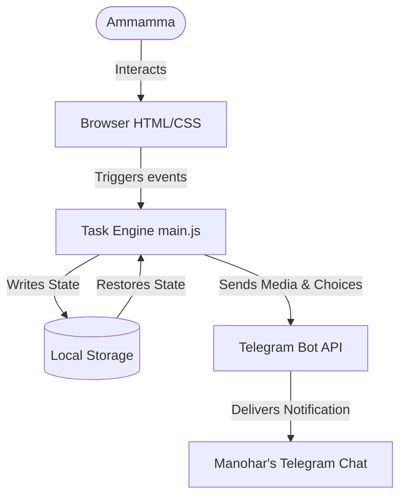

# 🐒 Project Analysis — Inside the Birthday Menace Engine v1000.0

Hey there! Welcome to the technical deep-dive of the **Birthday Menace — Ammamma Edition**. This project was hand-crafted with lots of laughter, cups of coffee, and coding practice. It's a custom-built, interactive birthday gauntlet designed to tease the birthday girl, Ammamma (aka Ammamma), and make her work for her gifts!

Here is how the chaos is engineered under the hood! 🚀🎂

---

## 📂 Code Structure & Map

The application is structured as a static multi-page web app. It is lightweight, fast, and does not require complex database hosting—relying instead on local browser storage and external API triggers.

- 🏠 **[index.html](file:///c:/Users/manoh/Downloads/Telegram%20Desktop/bday/birthday-menace/index.html)**: The main entry gate. It launches the cinematic rule introductory movie, playing typewriter text line by line.
- ⚙️ **[main.js](file:///c:/Users/manoh/Downloads/Telegram%20Desktop/bday/birthday-menace/main.js)**: The heart and soul. Tracks global state (keys collected, IQ level, active state) and handles common utility functions.
- 🎮 **Task Pages (`task1.html` to `task10.html`)**: Interactive mini-game components, each introducing a fresh annoyingly fun mechanic:
  - **Task 01**: Slide puzzle using Ammamma's face.
  - **Task 02**: Click pattern gauntlet (sequence matching).
  - **Task 03**: Truth or Dare sensor recorder (WebRTC media capture).
  - **Task 04**: Proximity-dodging banana game with bomb rains.
  - **Task 05**: Mystery box grid sacrifice system (with jumpscare!).
  - **Task 06**: Rigged coconut-shell gamble.
  - **Task 07**: Inverted-controls neon highway driving.
  - **Task 08**: Dodging mouse-repelling popups.
  - **Task 09**: Brainwash quiz terminal.
  - **Task 10**: Grand Finale box, cake candle blowout, and postcard capture.
- 🎁 **[gifts.html](file:///c:/Users/manoh/Downloads/Telegram%20Desktop/bday/birthday-menace/gifts.html)**: The final payoff. Resolves the key counts, triggers the monkey hand assistance if she failed to find 5 keys, displays heartwarming birthday wishes from friends, and lets her select her reward.

---

## 🛠️ Fun Technical Decisions & Features

### 1. Web Audio API Candle Blow-Out 🕯️💨
In **Task 10**, the user is asked to blow out the virtual birthday candles. Instead of a simple "click here" button, the engine accesses the user's microphone stream and runs it through a real-time `AudioContext` frequency analyzer:
- It creates an `AnalyserNode` with an `fftSize` of 256.
- It continuously samples the frequency bins.
- By tracking the peak volume (`Math.max(...audioBuffer)`), it detects the sharp, high-volume air burst of a "puff/blow".
- Once the threshold is exceeded, the candle flames disappear, a flash effect triggers, and a webcam snapshot is taken!

### 2. The Rigged Shell Game 🥥🔮
In **Task 06**, the user is shown three coconut shells hiding keys. Under normal circumstances, this would be a simple memory/tracking game. However, to stay true to the "Menace" theme, the logic is 100% rigged:
- If the user selects the shell where the key is currently located, the event handler intercepts the action, randomly shifts the key to one of the *other* two shells, and raises the other shell instead.
- This guarantees she will always lose the gamble and have to settle for the "consolation scratch card". Rigged is a feature here!

### 3. The Tab Switch Sentry 👁️🚫
To prevent the user from looking up answers or taking breaks, the engine implements a security sentry:
- It listens to the document `visibilitychange` event.
- If `document.hidden` becomes true (meaning she switched tabs, minimised the browser, or opened another app), a cheating penalty is registered.
- The sentry deducts between **10 to 40 IQ points**, flashes an alert, and forces a full page reload, wiping any unsaved game progress.

### 4. Direct Telegram API Reporting 📨🐒
When Ammamma completes a dare (like acting like a monkey or doing squats) or selects her final birthday gift:
- The app uses browser-native `MediaRecorder` to compile audio/video chunks into a `.webm` or `.ogg` blob.
- It automatically creates a `FormData` package and transmits it asynchronously via a POST request directly to a Telegram Bot API endpoint (`https://api.telegram.org/bot<TOKEN>/sendVideo` or `sendVoice`).
- This sends her funny evidence logs straight to Manohar's Telegram inbox in real time, making the surprise interactive!

---

## 🧬 Data Flow & State Management

The application keeps the data flow clean and reactive:

This setup ensures that even if she reloads a task or is forced to restart due to a sentry trigger, the main game indicators (current key count and cumulative IQ score) are synced seamlessly via `localStorage`!
