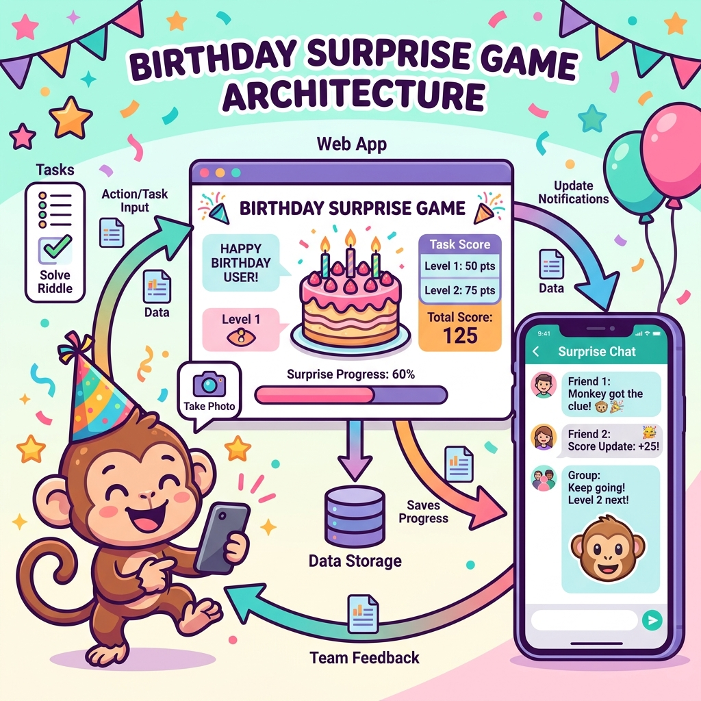
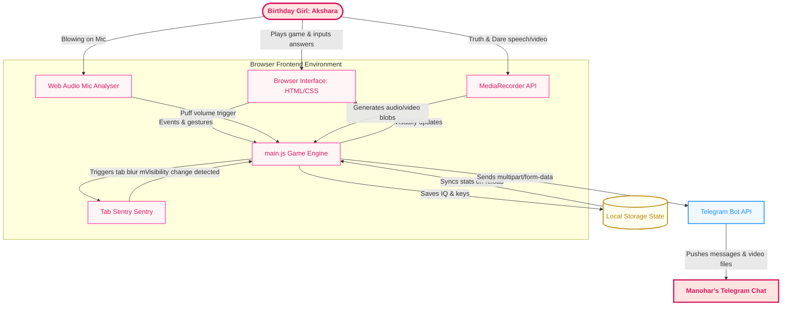

# 🏛️ Birthday Menace — System Architecture

Welcome to the architectural layout of the **Birthday Menace — Akshara Edition**! 🐒🎈

To ensure maximum surprise, playfulness, and smooth gameplay, the project connects the user browser environment directly to external alert systems. Below is how everything flows together!

---

## 🎨 Visual System Blueprint

Here is the high-level representation of our fun system design:

---

## 🔄 Dynamic Data Flow (Mermaid Source)

Here is the exact data flow diagram showing how Akshara's actions (playing, tab-switching, recording truths/dares, and choosing her gift) are captured and communicated:

---

## 🧬 Architectural Components

1. **The Game Client:** Built entirely with static web technologies (HTML5, Vanilla CSS3, Javascript ES6) to load instantly in any mobile or desktop browser without setting up a database or complex hosting.
2. **State & Recovery Manager:** Stores key status and current IQ points dynamically inside the browser's `localStorage` so that accidental refreshes do not ruin her progress.
3. **Tab Focus Sentry:** Monitors the browser window state and acts as a security system to prevent cheating or tab-switching, applying instant penalties.
4. **Media & Web Audio Analyzer:** Hooks into standard browser media capture APIs (camera, microphone, and canvas output) to make tasks interactive.
5. **Telegram Log Sync:** Communicates with a Telegram Bot to deliver her recording files and final choices straight to Manohar's chat.
